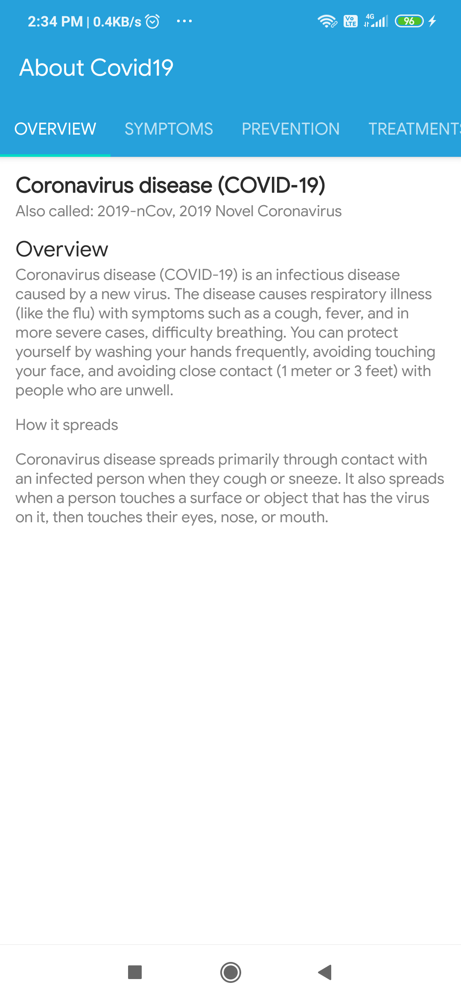

# Covid-19 Watch

**Covid-19 Watch** is a  Android application 📱 built to demonstrate use of *Modern Android development* tools. Dedicated to all Android Developers with ❤️.

<table style="width:100%">
  <tr>
    <th>Dashboard (Total Report of Covid-19 Watch World cases and country wise)</th>
    <th>CountryWise List (Date wise list progression specific country)</th>
    <th>About Corona Information (Source from WHO)</th>
  </tr>
  <tr>
    <td></td>
    <td></td>
    <td></td>
  </tr>
</table>

## About
- It simply loads **Total Covid-19 Watch cases in All over world** from [API](https://api.covid19api.com/).
- It notifies total cases of Covid-19 Watch in world after every 15 minute.

*It uses `PeriodicWorkManager` which is scheduled at the first run of an app. After that, `Worker` will execute after every 15 minute of interval and will show notification on Android's system tray.*

## Built With 🛠
- [Kotlin](https://kotlinlang.org/) - First class and official programming language for Android development.
- [Coroutines](https://kotlinlang.org/docs/reference/coroutines-overview.html) - For asynchronous and more..
- [Flow](https://kotlin.github.io/kotlinx.coroutines/kotlinx-coroutines-core/kotlinx.coroutines.flow/-flow/) - A cold asynchronous data stream that sequentially emits values and completes normally or with an exception.
- [Android Architecture Components](https://developer.android.com/topic/libraries/architecture) - Collection of libraries that help you design robust, testable, and maintainable apps.
- [LiveData](https://developer.android.com/topic/libraries/architecture/livedata) - Data objects that notify views when the underlying database changes.
- [ViewModel](https://developer.android.com/topic/libraries/architecture/viewmodel) - Stores UI-related data that isn't destroyed on UI changes.
- [Koin](https://start.insert-koin.io/) - Dependency Injection Framework (Kotlin)
- [Retrofit](https://square.github.io/retrofit/) - A type-safe HTTP client for Android and Java.
- [Moshi](https://github.com/square/moshi) - A modern JSON library for Kotlin and Java.
- [Moshi Converter](https://github.com/square/retrofit/tree/master/retrofit-converters/moshi) - A Converter which uses Moshi for serialization to and from JSON.
- [WorkManager](https://developer.android.com/topic/libraries/architecture/workmanager) - The WorkManager API makes it easy to schedule deferrable, asynchronous tasks that are expected to run even if the app exits or device restarts.
- [Material Components for Android](https://github.com/material-components/material-components-android) - Modular and customizable Material Design UI components for Android

# Project Structure

    com.sunil.covid19globalmeter    # Package

    ├── api                 # For API Service.
    ├── model               # Model classes
    ├── repository          # Repository to handle data from network using API.
    ├── di                  # Dependency Injection
    |
    ├── ui                  # Activity/View layer
    │                       # Activity,fragment,ViewModel,Work manager and RecyclerView Adapters.
    |
    ├── utils               # Utility Classes / Kotlin extensions

